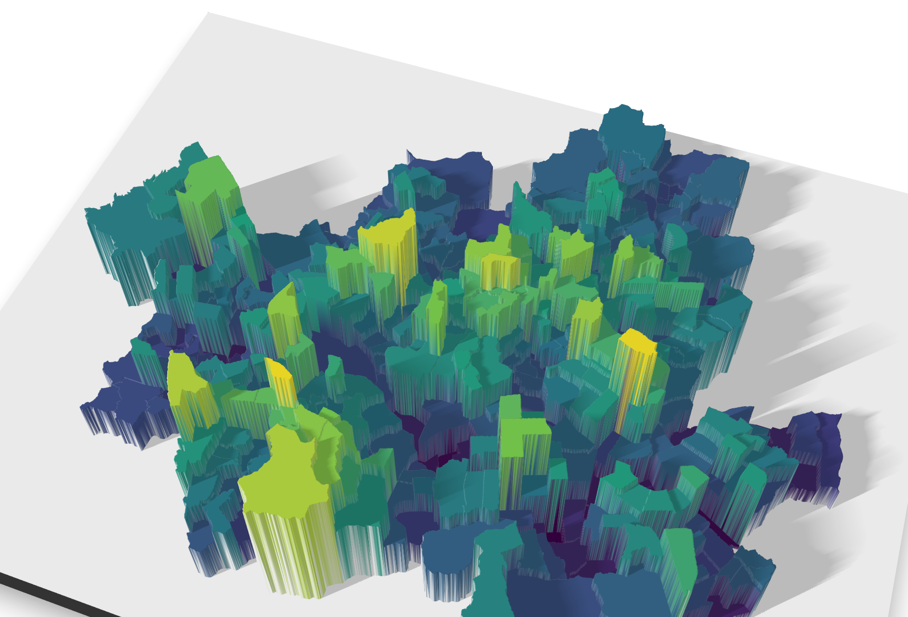

## 개념 규정

## 지도학적 일반화

<https://sangillee.snu.ac.kr/book_gis/vector_generalization.html>

## 기호화

### 시각 변수

#### 준비 작업

-   필수적인 패키지 불러오기

```{r}
library(tidyverse)
library(readxl)
library(sf)
library(tmap)
library(tmaptools)
library(rayshader)
library(ggpattern)
library(gridpattern)
```

-   지리공간데이터 불러오기

```{r}
#| output: false
seoul_EMD <- read_sf(
  "D:/My R/Korean Administrative Areas/행정구역 셰이프 파일/2 Original Cleaning/2021_4Q/SEOUL_EMD_2021_4Q.shp", options = "ENCODING=CP949")
seoul_EMD_2020 <- read_sf(
  "D:/My R/Korean Administrative Areas/행정구역 셰이프 파일/2 Original Cleaning/2020_2Q/SEOUL_EMD_2020_2Q.shp", options = "ENCODING=CP949")
seoul_gu <- read_sf(
  "D:/My R/Korean Administrative Areas/행정구역 셰이프 파일/2 Original Cleaning/2021_4Q/SEOUL_GU_2021_4Q.shp", options = "ENCODING=CP949")
seoul_sido <- read_sf(
  "D:/My R/Korean Administrative Areas/행정구역 셰이프 파일/2 Original Cleaning/2021_4Q/SEOUL_SIDO_2021_4Q.shp", options = "ENCODING=CP949")
```

-   지도 확인

```{r}
qtm(seoul_EMD)
```

-   1인가구 속성 데이터 불러오기

```{r}
house_SDGGEMD_2020 <- read_excel(
  "D:/My R/Population Geography/3 Population Structure/Housing_Size_2020_Adj.xlsx", sheet = 1
  )
```

-   결합하기

```{r}
seoul_EMD_2020 <- seoul_EMD_2020 |> 
  mutate(
    EMD_ID = as.numeric(EMD_ID)
  )
my_df <-seoul_EMD_2020 |> 
  left_join(
    house_SDGGEMD_2020, join_by(EMD_ID == Code)
  )
seoul_gu_df <- seoul_gu |> 
  left_join(
    house_SDGGEMD_2020, join_by(SGG1_CD == Code)
  )
```

#### 크기 size

-   지도 제작

```{r}
#| fig-height: 12.914
#| fig-width: 15.7721
#| fig-dpi: 600
my_map <- tm_shape(seoul_gu_df) + tm_borders(col = "gray10", lwd = 1.75) +
  tm_shape(seoul_gu_df) +
  tm_symbols(
    size = "T_house", fill_alpha = 0.75, fill = "#a63603", lwd = 0, 
    size.scale = tm_scale_continuous(values.scale = 8), 
    size.legend = tm_legend_hide()
  ) + 
  tm_layout(inner.margins = c(0.05, 0.05, 0.05, 0.05))
my_map
```

-   저장

```{r}
#| echo: false
#| eval: false

my.ratio <- get_asp_ratio(my_map)

my.title <- "4-1 크기"
my.path.name <- "D:/My Cartography/지도제작/"
my.file.name <- paste0(my.path.name, my.title, ".png")
tmap_save(my_map, filename = my.file.name, height = 11.74*1.1, width = my.ratio*11.74*1.1, dpi = 600)
```

#### 모양 shape

-   지도 제작

```{r}
#| eval: false
#| fig-height: 12.914
#| fig-width: 15.7721
#| fig-dpi: 600

pch_25 <- 0:24
names(pch_25) <- sort(unique(seoul_gu_df$SGG1_FNM))

my_graph <- ggplot(seoul_gu_df) +
  geom_sf_pattern(
    aes(pattern_shape = SGG1_FNM),
    pattern = "pch",
    # pattern_size = 0.1, # 외곽선 두께
    pattern_density = 0.4,
    pattern_fill = "white",
    pattern_color = "gray30",
    color = "black",
    fill = "white",
    lwd = 0.5,
    show.legend = FALSE
  ) +
  coord_sf() + 
  theme_bw() +
  scale_pattern_shape_manual(values = pch_25) +
  theme(
    panel.grid = element_blank(), 
    axis.text = element_blank(),
    axis.ticks = element_blank()
  )
my_graph
```

-   저장

```{r}
#| echo: false
#| eval: false

my.path.name <- "D:/My Cartography/지도제작/"
my.file.name <- paste0("4-2 모양", ".png")
ggsave(my.file.name, plot = my_graph, path = my.path.name, height = 12.914, width = 15.7721, dpi = 600)
```


#### 조감고도 perspective heights

-   ggplot2를 이용하여 지도 제작

```{r}
#| eval: false
my_map <- my_df |> 
  ggplot() +
  geom_sf(
    aes(fill = House1_p), 
    color = NA, show.legend = FALSE
    ) +
  labs(fill = "% of Single \n Households") + 
  scale_fill_viridis_c() +
  theme(
    axis.text = element_blank(),
    axis.ticks = element_blank(),
    panel.grid = element_blank(),
    panel.background = element_blank()
  )
my_map
```

-   3D

```{r}
#| eval: false
plot_gg(my_map, 
        width = 5, height = 4, scale = 300, 
        multicore = TRUE, windowsize = c(1726, 1174), 
        zoom = 0.35, phi = 55, theta = 20, sunangle = 225, fov = 70)
Sys.sleep(0.2)
```

-   포착

```{r}
#| echo: false
#| eval: false
render_snapshot(clear = TRUE, file = "D:/My Cartography/지도제작/4-3 조감고도.png")
```



#### 색상 hue

-   지도 제작

```{r}
#| fig-height: 12.914
#| fig-width: 15.7721
#| fig-dpi: 600
my_map <- my_df |> 
  tm_shape() + 
  tm_polygons(
    fill = "SGG1_NM", col = "gray20", lwd = 0.75, 
    fill.scale = tm_scale_categorical(
      # values = palette.colors(24, "Polychrome 36")
      values = "alphabet2"
    ),
    fill.legend = tm_legend_hide()
  ) + 
  tm_layout(inner.margins = c(0.05, 0.05, 0.05, 0.05))

my_map
```

-   저장

```{r}
#| echo: false
#| eval: false

my.ratio <- get_asp_ratio(my_map)

my.title <- "4-4 색상"
my.path.name <- "D:/My Cartography/지도제작/"
my.file.name <- paste0(my.path.name, my.title, ".png")
tmap_save(my_map, filename = my.file.name, height = 11.74*1.1, width = my.ratio*11.74*1.1, dpi = 600)
```

#### 명도 value

-   지도 제작

```{r}
#| fig-height: 12.914
#| fig-width: 15.7721
#| fig-dpi: 600

# 완전히 명도만의 컬러스킴 생성
library(colorspace)
cols <- sequential_hcl(
  n = 7,
  h = 250,           # 청색 계열 (240~260 사이에서 조정)
  c = c(8, 55),      # 양끝은 채도를 낮게(특히 밝은쪽/어두운쪽), 가운데만 채도 확보
  l = c(96, 28),     # 너무 어둡게(예: 15 이하) 가면 회색/보라로 꺾이기 쉬움
  power = 1.1
) 

my_map <- my_df |> 
  tm_shape() + 
  tm_polygons(
    fill = "House1_p", col = "gray20", lwd = 0.75, 
    fill.scale = tm_scale_intervals(
      breaks = c(-Inf, 15, 25, 35, 45, 55, 65, Inf),
      values = cols
    ), 
    fill.legend = tm_legend_hide()
  ) +
  tm_layout(inner.margins = c(0.05, 0.05, 0.05, 0.05))

my_map
```

-   저장

```{r}
#| echo: false
#| eval: false

my.ratio <- get_asp_ratio(my_map)

my.title <- "4-5 명도 1"
my.path.name <- "D:/My Cartography/지도제작/"
my.file.name <- paste0(my.path.name, my.title, ".png")
tmap_save(my_map, filename = my.file.name, height = 11.74*1.1, width = my.ratio*11.74*1.1, dpi = 600)
```

-   지도 제작

```{r}
#| fig-height: 12.914
#| fig-width: 15.7721
#| fig-dpi: 600

my_map <- my_df |> 
  tm_shape() + 
  tm_polygons(
    fill = "House1_p", col = "gray20", lwd = 0.75, 
    fill.scale = tm_scale_intervals(
      breaks = c(-Inf, 15, 25, 35, 45, 55, 65, Inf),
      values = "brewer.blues"
    ), 
    fill.legend = tm_legend_hide()
  ) +
  tm_layout(inner.margins = c(0.05, 0.05, 0.05, 0.05))

my_map
```

-   저장

```{r}
#| echo: false
#| eval: false

my.ratio <- get_asp_ratio(my_map)

my.title <- "4-5 명도 2"
my.path.name <- "D:/My Cartography/지도제작/"
my.file.name <- paste0(my.path.name, my.title, ".png")
tmap_save(my_map, filename = my.file.name, height = 11.74*1.1, width = my.ratio*11.74*1.1, dpi = 600)
```

#### 채도 saturation

-   지도 제작

```{r}
#| fig-height: 12.914
#| fig-width: 15.7721
#| fig-dpi: 600

saturation_7 <- c("#18C800", "#24BB0E", "#2FA81F", "#3A9531", 
  "#46833F", "#516F4C", "#5C5C5C")

my_map <- my_df |> 
  tm_shape() + 
  tm_polygons(
    fill = "House1_p", col = "gray20", lwd = 0.75, 
    fill.scale = tm_scale_intervals(
      breaks = c(-Inf, 15, 25, 35, 45, 55, 65, Inf),
      values = saturation_7
    ), 
    fill.legend = tm_legend_hide()
  ) +
  tm_layout(inner.margins = c(0.05, 0.05, 0.05, 0.05))

my_map
```

-   저장

```{r}
#| echo: false
#| eval: false

my.ratio <- get_asp_ratio(my_map)

my.title <- "4-6 채도"
my.path.name <- "D:/My Cartography/지도제작/"
my.file.name <- paste0(my.path.name, my.title, ".png")
tmap_save(my_map, filename = my.file.name, height = 11.74*1.1, width = my.ratio*11.74*1.1, dpi = 600)
```

#### 간격 spacing

-   지도 제작

```{r}
#| eval: false
#| fig-height: 12.914
#| fig-width: 15.7721
#| fig-dpi: 600
my_graph <- ggplot(seoul_gu_df) +
  geom_sf_pattern(
    aes(pattern_spacing = -House1_p),
    pattern = "weave",
    pattern_angle = 45,
    pattern_size = 0.2,
    pattern_fill = "white",
    pattern_color = "gray30",
    pattern_density = 1,
    color = "black",
    fill = "white",
    lwd = 0.5,
    show.legend = FALSE
  ) +
  coord_sf() + 
  theme_bw() +
  theme(
    panel.grid = element_blank(), 
    axis.text = element_blank(),
    axis.ticks = element_blank()
  )
my_graph
```

-   저장

```{r}
#| echo: false
#| eval: false

my.path.name <- "D:/My Cartography/지도제작/"
my.file.name <- paste0("4-7 간격", ".png")
ggsave(my.file.name, plot = my_graph, path = my.path.name, height = 12.914, width = 15.7721, dpi = 600)
```


#### 방향 orientation

-   지도 제작

```{r}
#| eval: false
#| fig-height: 12.914
#| fig-width: 15.7721
#| fig-dpi: 600
my_graph <- ggplot(seoul_gu_df) +
  geom_sf_pattern(
    aes(pattern_angle = House1_p),
    pattern = "stripe",
    pattern_size = 0.2,
    pattern_spacing = 0.02,
    pattern_fill = "white",
    pattern_color = "gray30",
    pattern_density = 1,
    color = "black",
    fill = "white",
    lwd = 0.5,
    show.legend = FALSE
  ) +
  coord_sf() + 
  theme_bw() +
  theme(
    panel.grid = element_blank(), 
    axis.text = element_blank(),
    axis.ticks = element_blank()
  )
my_graph
```

-   저장

```{r}
#| echo: false
#| eval: false

my.path.name <- "D:/My Cartography/지도제작/"
my.file.name <- paste0("4-8 방향", ".png")
ggsave(my.file.name, plot = my_graph, path = my.path.name, height = 12.914, width = 15.7721, dpi = 600)
```


#### 질감 texture

```{r}
#| eval: false
#| fig-height: 12.914
#| fig-width: 15.7721
#| fig-dpi: 600
library(ggpattern)
library(gridpattern)
library(magick)

set.seed(1234)
magick_25 <- sample(c("bricks", "checkerboard", "circles", "crosshatch", "fishscales",
                      "hexagons", "horizontal",  "horizontalsaw",   "hs_bdiagonal", 
                      "hs_cross", "hs_diagcross", "hs_fdiagonal", "hs_horizontal", 
                      "hs_vertical", "left30", "leftshingle", "octagons", "right45",
                      "rightshingle", "smallfishscales", "vertical", "verticalbricks",
                      "verticalleftshingle", "verticalrightshingle", "verticalsaw"), 25)        

my_graph <- ggplot(seoul_gu_df) +
  geom_sf_pattern(
    aes(pattern_type = SGG1_FNM),
    pattern = "magick",
    pattern_scale = 10, # 해상도 높은 이미지 산출을 위한 핵심
    pattern_fill = "black",
    color = "black",
    fill = "white",
    lwd = 0.5,
    show.legend = FALSE
  ) +
  coord_sf() + 
  theme_bw() +
  scale_pattern_type_discrete(choices = magick_25) +
  theme(
    panel.grid = element_blank(), 
    axis.text = element_blank(),
    axis.ticks = element_blank()
  )
my_graph
```

-   저장

```{r}
#| echo: false
#| eval: false

my.path.name <- "D:/My Cartography/지도제작/"
my.file.name <- paste0("4-9 질감", ".png")
ggsave(my.file.name, plot = my_graph, path = my.path.name, height = 12.914, width = 15.7721, dpi = 600)
```


