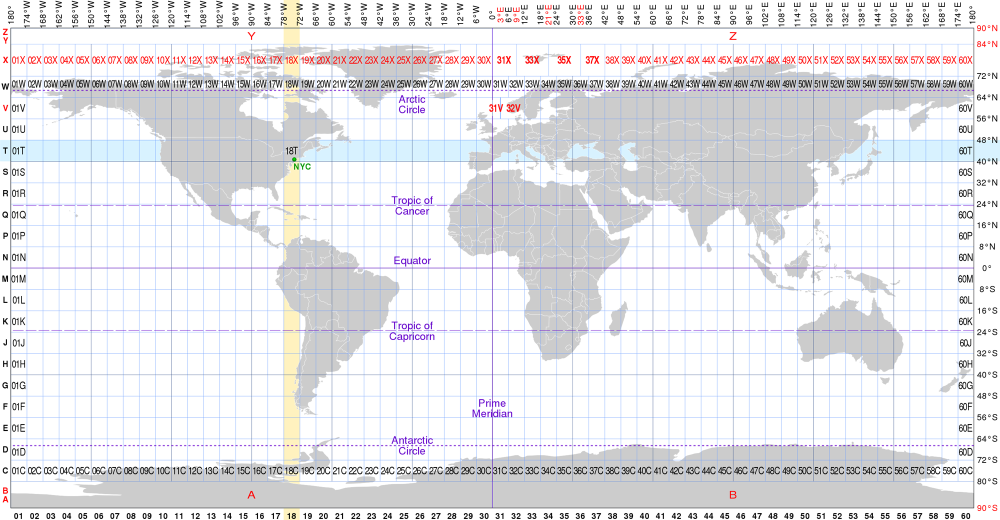
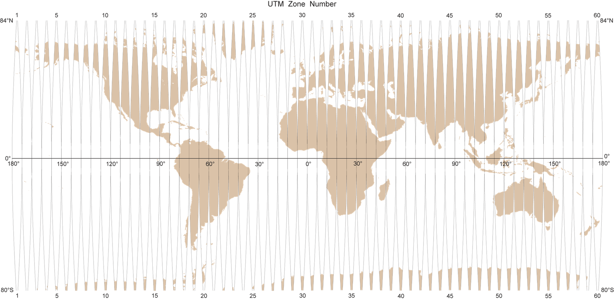
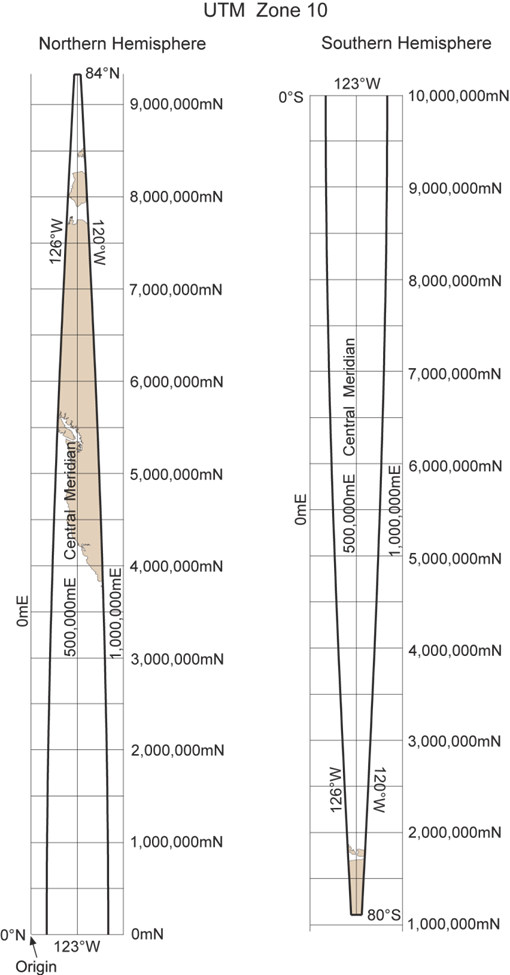
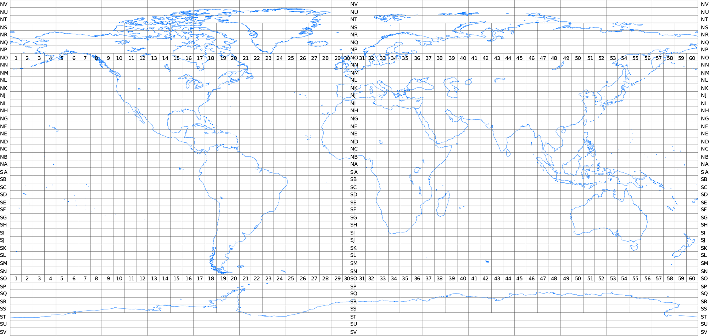
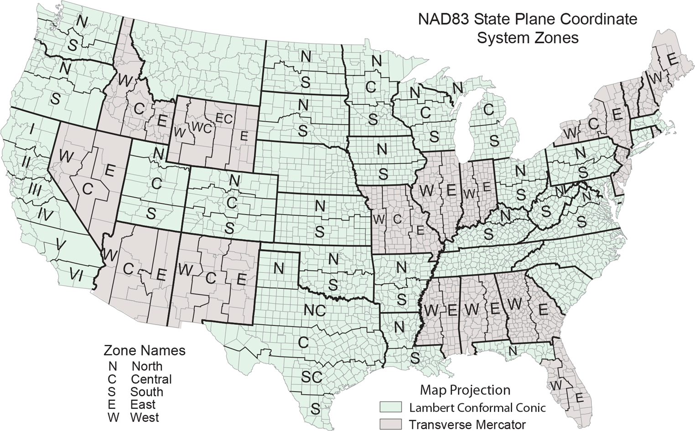
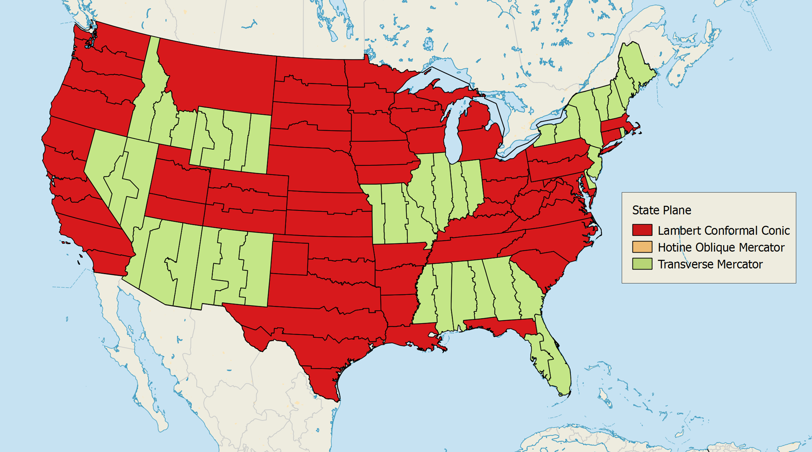
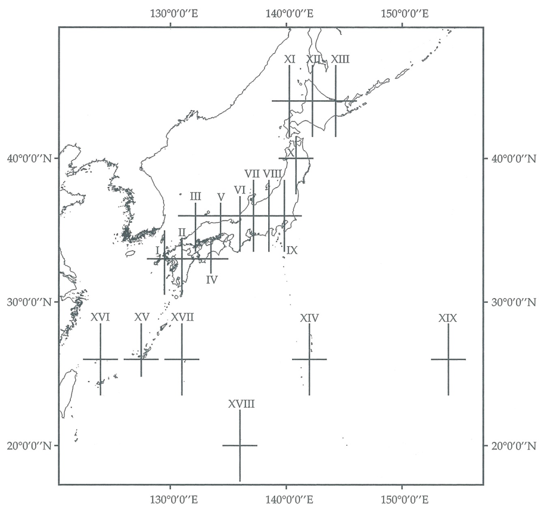
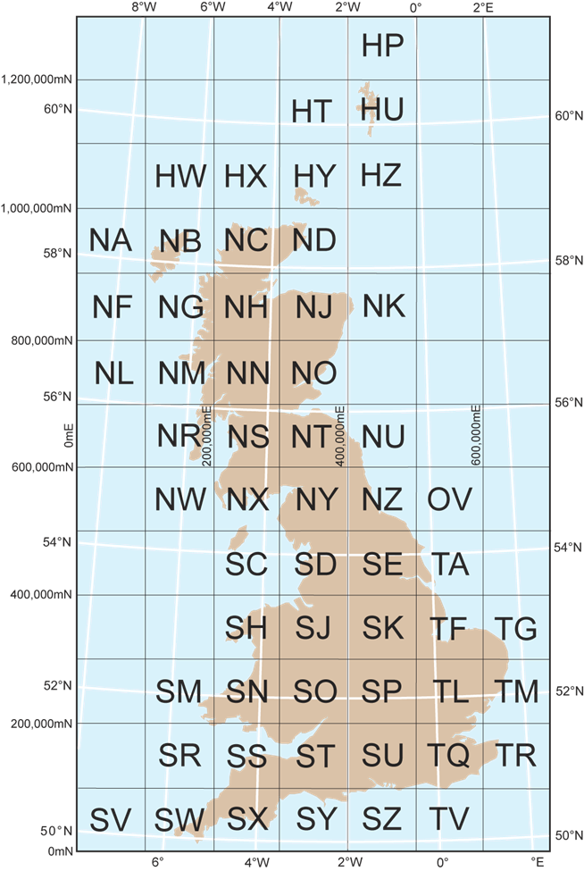

## 좌표계의 정의와 기본 좌표계

### 좌표계의 정의

### 기본 좌표계

#### 2차원 데카르트 좌표계

```{r}
#| fig-height: 12
#| fig-width: 12
#| fig-dpi: 600
library(tidyverse)
library(grid)

px <- 7
py <- 6

my_graph <- ggplot() +
  geom_vline(xintercept = seq(-11, 13, 1), color = "gray", linewidth = 0.3) +
  geom_hline(yintercept = seq(-11, 13, 1), color = "gray", linewidth = 0.3) +
  geom_segment(aes(x = -10, y = 0, xend = 10, yend = 0), color = "blue", linewidth = 1, 
               arrow = arrow(ends = "both", length = unit(0.3, "cm"))) +
  geom_segment(aes(x = 0, y = -10, xend = 0, yend = 10), color = "red", linewidth = 1, 
               arrow = arrow(ends = "both", length = unit(0.3, "cm"))) +
  annotate("segment", x = px, y = 0, xend = px, yend = py, linetype = "dashed", 
           color = "blue", linewidth = 1) +
  annotate("segment", x = 0, y = py, xend = px, yend = py, linetype = "dashed", 
           color = "red", linewidth = 1) +
  annotate("text", x = px, y = py, label = "(7, 6)", hjust = -0.2, vjust = -0.2,
           color = "purple4", size = 9) +
  annotate("text", x = 1:9, y = -0.5, label = 1:9, size = 7) +
  annotate("text", x = -0.5, y = 1:9, label = 1:9, size = 7) +
  annotate("text", x = 11.5, y = 0, label = "X-axis", size = 8) +
  annotate("text", x = 0, y = 11, label = "Y-axis", size = 8) +
  annotate("text", x = -0.8, y = -0.5, label = "(0,0)", size = 8) +
  geom_point(aes(px, py), color = "purple4", size = 5) +
  geom_point(aes(0, 0), color = "black", size = 5) +
  coord_fixed(xlim = c(-11, 13), ylim = c(-11, 13), expand = FALSE) +
  theme_void() +
  theme(panel.border = element_rect(color = "black", fill = NA, linewidth = 0.8))
my_graph
```

```{r}
#| echo: false
#| eval: false

my.path.name <- "D:/My Cartography/지도제작/"
my.file.name <- paste0("6-1-1 데카르트 좌표계 2차원", ".png")
ggsave(my.file.name, plot = my_graph, path = my.path.name, height = 12, width = 12, dpi = 600)
```

#### 2차원 극 좌표계

```{r}
#| fig-height: 12
#| fig-width: 12
#| fig-dpi: 600
r <- 3.5
theta_deg <- 60
theta <- theta_deg * pi / 180

px <- r * cos(theta)
py <- r * sin(theta)

px_long <- 6.5 * cos(theta)
py_long <- 6.5 * sin(theta)

circle_df <- do.call(
  rbind,
  lapply(1:6, function(rad) {
    ang <- seq(0, 2*pi, length.out = 400)
    data.frame(
      x = rad * cos(ang),
      y = rad * sin(ang),
      id = rad
    )
  })
)

angles_deg <- seq(0, 315, 45)
spoke_df <- data.frame(
  x = 0, y = 0,
  xend = 6.5 * cos(angles_deg * pi / 180),
  yend = 6.5 * sin(angles_deg * pi / 180)
)

arc_ang <- seq(0, theta, length.out = 200)
arc_df <- data.frame(
  x = 3.5 * cos(arc_ang),
  y = 3.5 * sin(arc_ang)
)

label_r <- 6.8
label_df <- data.frame(
  angle = angles_deg,
  label = paste0(angles_deg, "°"),
  x = label_r * cos(angles_deg * pi / 180),
  y = label_r * sin(angles_deg * pi / 180)
)

radius_x_df <- data.frame(x = 1:6, y = 0, label = 1:6)
radius_y_df <- data.frame(x = 0, y = 1:6, label = 1:6)

my_graph <- ggplot() +
  geom_path(data = circle_df, aes(x, y, group = id), color = "gray30", linewidth = 0.7) +
  geom_segment(data = spoke_df, aes(x = x, y = y, xend = xend, yend = yend), 
               color = "gray30", linewidth = 0.7) +
  annotate("segment", x = 0, y = 0, xend = px_long, yend = py_long,
           color = "red", linetype = "dashed", linewidth = 1) +
  annotate("segment", x = 0, y = 0, xend = px, yend = py, color = "red", linewidth = 1.2) +
  annotate("segment", x = 0, y = 0, xend = 6.5, yend = 0, color = "blue", linewidth = 1.2) +
  geom_path(data = arc_df, aes(x, y), color = "red", linewidth = 1, linetype = "dashed") +
  geom_point(aes(px, py), color = "purple4", size = 5) +
  annotate("text", x = px - 0.78, y = py + 0.37, label = "(3.5, 60°)", color = "purple4", size = 9) +
  geom_text(data = label_df, aes(x, y, label = label), color = "black", size = 7) +
  geom_text(data = radius_x_df, aes(x + 0.15, y - 0.2, label = label), color = "black", size = 7) +
  geom_text(data = radius_y_df, aes(x - 0.2, y + 0.15, label = label), color = "black", size = 7) +
  geom_point(aes(0, 0), color = "black", size = 5) +
  annotate("text", x = px_long + 0.1, y = py_long + 0.1, label = "60°", 
       color = "purple4", size = 7) +
  coord_fixed(xlim = c(-7.5, 7.5), ylim = c(-7.5, 7.5), expand = FALSE) +
  theme_void() +
  theme(
    panel.background = element_rect(fill = "white", color = NA),
    plot.background = element_rect(fill = "white", color = NA),
    panel.border = element_rect(color = "black", fill = NA, linewidth = 0.8)
  )
my_graph
```

```{r}
#| echo: false
#| eval: false

my.path.name <- "D:/My Cartography/지도제작/"
my.file.name <- paste0("6-1-2 극 좌표계 2차원", ".png")
ggsave(my.file.name, plot = my_graph, path = my.path.name, height = 12, width = 12, dpi = 600)
```

#### 2차원 데카르트 좌표계와 극 좌표계의 결합

```{r}
#| fig-height: 12
#| fig-width: 12
#| fig-dpi: 600
r <- 3.5
theta_deg <- 60
theta <- theta_deg * pi / 180

px <- r * cos(theta)
py <- r * sin(theta)

px_long <- 6.5 * cos(theta)
py_long <- 6.5 * sin(theta)

circle_df <- do.call(
  rbind,
  lapply(1:6, function(rad) {
    ang <- seq(0, 2*pi, length.out = 400)
    data.frame(
      x = rad * cos(ang),
      y = rad * sin(ang),
      id = rad
    )
  })
)

angles_deg <- seq(0, 315, 45)
spoke_df <- data.frame(
  x = 0, y = 0,
  xend = 6.5 * cos(angles_deg * pi / 180),
  yend = 6.5 * sin(angles_deg * pi / 180)
)

arc_ang <- seq(0, theta, length.out = 200)
arc_df <- data.frame(
  x = 3.5 * cos(arc_ang),
  y = 3.5 * sin(arc_ang)
)

label_r <- 6.8
label_df <- data.frame(
  angle = angles_deg,
  label = paste0(angles_deg, "°"),
  x = label_r * cos(angles_deg * pi / 180),
  y = label_r * sin(angles_deg * pi / 180)
)

radius_x_df <- data.frame(x = 1:6, y = 0, label = 1:6)
radius_y_df <- data.frame(x = 0, y = 1:6, label = 1:6)

my_graph <- ggplot() +
  geom_path(data = circle_df, aes(x, y, group = id), color = "gray30", linewidth = 0.7) +
  geom_segment(data = spoke_df, aes(x = x, y = y, xend = xend, yend = yend), 
               color = "gray30", linewidth = 0.7) +
  # annotate("segment", x = 0, y = 0, xend = px_long, yend = py_long, 
  #          color = "red", linetype = "dashed", linewidth = 1) +
  annotate("segment", x = px_long, y = py_long, xend = px + 0.1, yend = py + 0.1, color = "green", 
           linetype = "solid", linewidth = 1, 
           arrow = arrow(length = unit(0.3, "cm"), ends = "last")) +
  annotate("segment", x = 0, y = 0, xend = px, yend = py, color = "red", linewidth = 1.2) +
  annotate("segment", x = 0, y = 0, xend = 6.5, yend = 0, color = "blue", linewidth = 1.2) +
  annotate("segment", x = 1.75, y = 0, xend = 1.75, yend = 3.03, linetype = "dashed", 
           color = "blue", linewidth = 1) +
  annotate("segment", x = 0, y = 3.03, xend = 1.75, yend = 3.03, linetype = "dashed", 
           color = "red", linewidth = 1) +
  geom_path(data = arc_df, aes(x, y), color = "red", linewidth = 1, linetype = "dashed") +
  geom_point(aes(px, py), color = "purple4", size = 5) +
  annotate("text", x = px - 0.78, y = py + 0.37, label = "(3.5, 60°)", color = "purple4", size = 9) +
  annotate("text", x = px_long, y = py_long + 0.3, label = "(1.75, 3.03)", 
           color = "purple4", size = 9) +
  geom_text(data = label_df, aes(x, y, label = label), color = "black", size = 7) +
  geom_text(data = radius_x_df, aes(x + 0.15, y - 0.2, label = label), color = "black", size = 7) +
  geom_text(data = radius_y_df, aes(x - 0.2, y + 0.15, label = label), color = "black", size = 7) +
  geom_point(aes(0, 0), color = "black", size = 5) +
  coord_fixed(xlim = c(-7.5, 7.5), ylim = c(-7.5, 7.5), expand = FALSE) +
  theme_void() +
  theme(
    panel.background = element_rect(fill = "white", color = NA),
    plot.background = element_rect(fill = "white", color = NA),
    panel.border = element_rect(color = "black", fill = NA, linewidth = 0.8)
  )
my_graph
```

```{r}
#| echo: false
#| eval: false

my.path.name <- "D:/My Cartography/지도제작/"
my.file.name <- paste0("6-1-3 2차원 종합", ".png")
ggsave(my.file.name, plot = my_graph, path = my.path.name, height = 12, width = 12, dpi = 600)
```

#### 3차원 데카르트 좌표계

```{r}
#| fig-height: 10.5
#| fig-width: 11.3
#| fig-dpi: 600
library(ggplot2)
library(grid)

O  <- c(0, 0)
Xb <- c(-3.2, -3.2)
Yb <- c(4.8, 0)
Zb <- c(0, 5.2)

B  <- c(2.2, -2.1)
P  <- c(2.2, 1.2)
Xc <- c(-2.1, -2.1)
Yc <- c(4, 0)
Zc <- c(0, 3.3)

my_graph <- ggplot() +
  
  # axes
  annotate("segment", x=0,y=0,xend=Xb[1],yend=Xb[2],
           color="blue", linewidth=1,
           arrow=arrow(length=unit(0.2,"cm"))) +
  annotate("segment", x=0,y=0,xend=Yb[1],yend=Yb[2],
           color="blue", linewidth=1,
           arrow=arrow(length=unit(0.2,"cm"))) +
  annotate("segment", x=0,y=0,xend=Zb[1],yend=Zb[2],
           color="blue", linewidth=1,
           arrow=arrow(length=unit(0.2,"cm"))) +
  
  # cartesian components
  annotate("segment", x=0,y=0,xend=B[1],yend=B[2],
           color="red", linewidth=1.2) +
  annotate("segment", x=Xc[1],y=Xc[2],xend=B[1],yend=B[2],
           color="red", linetype="dashed", linewidth=1) +
  annotate("segment", x=B[1],y=B[2],xend=P[1],yend=P[2],
           color="red", linetype="dashed", linewidth=1) +
  annotate("segment", x=P[1],y=P[2],xend=Zc[1],yend=Zc[2],
           color="red", linetype="dashed", linewidth=1) +
  annotate("segment", x=B[1], y=B[2], xend=Yc[1], yend=Yc[2],
           color="red", linetype="dashed", linewidth=1) +
  
  # point
  geom_point(aes(P[1],P[2]), color="purple4", size=5) +
  geom_point(aes(0,0), color="black", size=5) +

  # component labels
  annotate("text", x=Xc[1]-0.2, y=Xc[2], label= expression(italic(x)), color="black", size=7) +
  annotate("text", x=Yb[1]-0.7, y=0.2, label= expression(italic(y)), color="black", size=7) +
  annotate("text", x=Zc[1]-0.2, y=Zc[2], label= expression(italic(z)), color="black", size=7) +
  
  # axis labels
  annotate("text", x=Xb[1]-0.3, y=Xb[2]-0.5, label="X-Axis",
           color="black", size=8) +
  annotate("text", x=Yb[1]+1, y=Yb[2], label="Y-Axis",
           color="black", size=8) +
  annotate("text", x=Zb[1], y=Zb[2]+0.5, label="Z-Axis",
           color="black", size=8) +
  
  # point label
  annotate("text", x=P[1] + 0.8, y=P[2], 
          label = expression("(" * italic(x) * ", " * italic(y) * ", " * italic(z) * ")"),
          color="black", size=9) +
  
  coord_fixed(xlim=c(-4.5,6.8), ylim=c(-4.25,6.25), expand = FALSE) +
  theme_void() +
  theme(panel.border = element_rect(color="black", fill=NA), linewidth = 0.8)

my_graph
```

```{r}
#| echo: false
#| eval: false

my.path.name <- "D:/My Cartography/지도제작/"
my.file.name <- paste0("6-1-4 3차원 데카르트", ".png")
ggsave(my.file.name, plot = my_graph, path = my.path.name, height = 10.5, width = 11.3, dpi = 600)
```

#### 3차원 극 좌표계

```{r}
#| fig-height: 10.5
#| fig-width: 11.3
#| fig-dpi: 600

library(tidyverse)
library(grid)

O  <- c(0, 0)
Xb <- c(-3.2, -3.2)
Yb <- c(4.8, 0)
Zb <- c(0, 5.2)

B  <- c(2.2, -2.1)
P  <- c(2.2, 1.2)

ang_X <- atan2(Xb[2], Xb[1])
ang_B <- atan2(B[2], B[1])

theta_r <- 1.2
theta_seq <- seq(ang_X, ang_B, length.out = 120)

theta_arc <- data.frame(
  x = theta_r * cos(theta_seq),
  y = theta_r * sin(theta_seq)
)

# phi arc: O->B 와 O->P 사이의 각 (작게)
ang_P <- atan2(P[2], P[1])

phi_r <- 0.9
phi_seq <- seq(ang_B, ang_P, length.out = 120)

phi_arc <- data.frame(
  x = phi_r * cos(phi_seq),
  y = phi_r * sin(phi_seq)
)

my_graph <- ggplot() +
  
  # axes
  annotate("segment", x=0,y=0,xend=Xb[1],yend=Xb[2],
           color="blue", linewidth=1,
           arrow=arrow(length=unit(0.2,"cm"))) +
  annotate("segment", x=0,y=0,xend=Yb[1],yend=Yb[2],
           color="blue", linewidth=1,
           arrow=arrow(length=unit(0.2,"cm"))) +
  annotate("segment", x=0,y=0,xend=Zb[1],yend=Zb[2],
           color="blue", linewidth=1,
           arrow=arrow(length=unit(0.2,"cm"))) +
  
  # polar components
  annotate("segment", x=0,y=0,xend=B[1],yend=B[2],
           color="magenta2", linewidth=1.2) +
  annotate("segment", x=B[1],y=B[2],xend=P[1],yend=P[2],
           color="magenta2", linetype="dashed", linewidth=1) +
  annotate("segment", x=0,y=0,xend=P[1],yend=P[2],
           color="magenta2", linetype="dashed", linewidth=1) +
  
  # angle arcs
  geom_path(data = theta_arc, aes(x, y),
            color = "purple4", linetype = "dashed", linewidth = 1) +
  geom_path(data = phi_arc, aes(x, y),
            color = "purple4", linetype = "dashed", linewidth = 1) +
  
  # point
  geom_point(aes(P[1],P[2]), color="purple4", size=5) +
  geom_point(aes(0,0), color="black", size=5) +
  
  # component labels
  annotate("text", x = 1, y = 0.8, label = expression(italic(r)), color = "black", size = 7) +
  annotate("text", x = 1.1, y = -0.15, label = expression(italic(φ)), color = "black", size = 7) +
  annotate("text", x = 0, y = -0.95, label = expression(italic(θ)), color = "black", size = 7) +
  
  # axis labels
  annotate("text", x=Xb[1]-0.3, y=Xb[2]-0.5, label="X-Axis",
           color="black", size=8) +
  annotate("text", x=Yb[1]+1, y=Yb[2], label="Y-Axis",
           color="black", size=8) +
  annotate("text", x=Zb[1], y=Zb[2]+0.5, label="Z-Axis",
           color="black", size=8) +
  
  # point label
  annotate("text", x=P[1] + 0.8, y=P[2], 
           label = expression("(" * italic(φ) * ", " * italic(θ) * ", " * italic(r) * ")"),
           color="black", size=9) +
  
  coord_fixed(xlim=c(-4.5,6.8), ylim=c(-4.25,6.25), expand = FALSE) +
  theme_void() +
  theme(panel.border = element_rect(color="black", fill=NA), linewidth = 0.8)

my_graph
```

```{r}
#| echo: false
#| eval: false

my.path.name <- "D:/My Cartography/지도제작/"
my.file.name <- paste0("6-1-5 3차원 극 좌표계", ".png")
ggsave(my.file.name, plot = my_graph, path = my.path.name, height = 10.5, width = 11.3, dpi = 600)
```

#### 3차원 데카르트 좌표계와 극 좌표계의 결합

```{r}
#| fig-height: 10.5
#| fig-width: 11.3
#| fig-dpi: 600

library(tidyverse)
library(grid)

O  <- c(0, 0)
Xb <- c(-3.2, -3.2)
Yb <- c(4.8, 0)
Zb <- c(0, 5.2)

B  <- c(2.2, -2.1)
P  <- c(2.2, 1.2)
Xc <- c(-2.1, -2.1)
Yc <- c(4, 0)
Zc <- c(0, 3.3)

ang_X <- atan2(Xb[2], Xb[1])
ang_B <- atan2(B[2], B[1])
ang_P <- atan2(P[2], P[1])

theta_r <- 1.2
theta_seq <- seq(ang_X, ang_B, length.out = 120)

theta_arc <- data.frame(
  x = theta_r * cos(theta_seq),
  y = theta_r * sin(theta_seq)
)

phi_r <- 0.9
phi_seq <- seq(ang_B, ang_P, length.out = 120)

phi_arc <- data.frame(
  x = phi_r * cos(phi_seq),
  y = phi_r * sin(phi_seq)
)

my_graph <- ggplot() +
  
  # axes
  annotate("segment", x = 0, y = 0, xend = Xb[1], yend = Xb[2],
           color = "blue", linewidth = 1,
           arrow = arrow(length = unit(0.2, "cm"))) +
  annotate("segment", x = 0, y = 0, xend = Yb[1], yend = Yb[2],
           color = "blue", linewidth = 1,
           arrow = arrow(length = unit(0.2, "cm"))) +
  annotate("segment", x = 0, y = 0, xend = Zb[1], yend = Zb[2],
           color = "blue", linewidth = 1,
           arrow = arrow(length = unit(0.2, "cm"))) +
  
  # polar components
  annotate("segment", x = 0, y = 0, xend = B[1], yend = B[2],
           color = "magenta2", linewidth = 1.2) +
  annotate("segment", x = B[1], y = B[2], xend = P[1], yend = P[2],
           color = "magenta2", linetype = "dashed", linewidth = 1) +
  annotate("segment", x = 0, y = 0, xend = P[1], yend = P[2],
           color = "magenta2", linetype = "dashed", linewidth = 1) +
  
  # cartesian components
  annotate("segment", x = Xc[1], y = Xc[2], xend = B[1], yend = B[2],
           color = "red", linetype = "dashed", linewidth = 1) +
  annotate("segment", x = B[1], y = B[2], xend = Yc[1], yend = Yc[2],
           color = "red", linetype = "dashed", linewidth = 1) +
  annotate("segment", x = P[1], y = P[2], xend = Zc[1], yend = Zc[2],
           color = "red", linetype = "dashed", linewidth = 1) +
  
  # angle arcs
  geom_path(data = theta_arc, aes(x, y),
            color = "purple4", linetype = "dashed", linewidth = 1) +
  geom_path(data = phi_arc, aes(x, y),
            color = "purple4", linetype = "dashed", linewidth = 1) +
  
  # point
  geom_point(aes(P[1], P[2]), color = "purple4", size = 5) +
  geom_point(aes(0, 0), color = "black", size = 5) +
  
  # polar labels
  annotate("text", x = 1, y = 0.8, label = expression(italic(r)), color = "black", size = 7) +
  annotate("text", x = 1.1, y = -0.15, label = expression(italic(φ)), color = "black", size = 7) +
  annotate("text", x = 0, y = -0.95, label = expression(italic(θ)), color = "black", size = 7) +
  
  # cartesian labels
  annotate("text", x=Xc[1]-0.2, y=Xc[2], label= expression(italic(x)), color="black", size=7) +
  annotate("text", x=Yb[1]-0.7, y=0.2, label= expression(italic(y)), color="black", size=7) +
  annotate("text", x=Zc[1]-0.2, y=Zc[2], label= expression(italic(z)), color="black", size=7) +
  
  # axis labels
  annotate("text", x = Xb[1] - 0.3, y = Xb[2] - 0.5, label = "X-Axis",
           color = "black", size = 8) +
  annotate("text", x = Yb[1] + 1, y = Yb[2], label = "Y-Axis",
           color = "black", size = 8) +
  annotate("text", x = Zb[1], y = Zb[2] + 0.5, label = "Z-Axis",
           color = "black", size = 8) +
  
  # point label
  annotate("text", x = P[1] + 0.8, y = P[2] + 0.2, 
          label = expression("(" * italic(x) * ", " * italic(y) * ", " * italic(z) * ")"),
           color="black", size=9) +
  annotate("text", x = P[1] + 0.8, y = P[2] - 0.2, 
           label = expression("(" * italic(φ) * ", " * italic(θ) * ", " * italic(r) * ")"),
           color = "black", size = 9) +
  
  coord_fixed(xlim = c(-4.5, 6.8), ylim = c(-4.25, 6.25), expand = FALSE) +
  theme_void() +
  theme(
    panel.border = element_rect(color = "black", fill = NA),
    linewidth = 0.8
  )

my_graph
```

```{r}
#| echo: false
#| eval: false

my.path.name <- "D:/My Cartography/지도제작/"
my.file.name <- paste0("6-1-6 3차원 종합", ".png")
ggsave(my.file.name, plot = my_graph, path = my.path.name, height = 10.5, width = 11.3, dpi = 600)
```

### 지도 투영을 위한 좌표계

## 구체 혹은 타원체 좌표계

### 지리좌표계



### 측지좌표계

### 지심좌표계

### 좌표변환

## 평면 직각 좌표계

### 개념 규정

### 구성 요소

### 종류

### UTM 좌표계

#### UTM 좌표계의 개요





{fig-align="center"}

#### UTM 좌표계와 우리나라

우선 우리나라가 포함된 UTM 그리드(51T, 52T, 51S, 52S)에 대한 개관도를 작성한다.

-   필수 패키지 불러오기

```{r}
library(tidyverse) 
library(rnaturalearth)
library(sf) 
library(tmap) 
library(tmaptools)
```

-   지리공간데이터 불러와 정리하기

```{r}
#| echo: true
#| output: false
#| eval: true
countries <- ne_download(scale = 50, type = "countries", category = "cultural") |> 
  st_as_sf()
utm_grid <- st_read(
  "D:/My R/World Data Manupulation/World UTM Grid/World_UTM_Grid.shp", options = "ENCODING=CP949"
  )

# utm_grid의 재투영
utm_grid <- utm_grid |> 
  st_transform(crs = st_crs(countries))

# UTM 이름 재정의
utm_grid <- utm_grid |> 
  mutate(
    utm_name = str_c(ZONE, ROW_)
  ) |> 
  relocate(
    utm_name
  )
```

-   지도 제작 및 저장

```{r}
#| fig-height: 12.914
#| fig-width: 13.93353
#| fig-dpi: 600
utm_grid_korea <- utm_grid |> 
  filter(
    utm_name %in% c("51T", "52T", "51S", "52S")
  ) |> 
  st_transform(crs = st_crs(countries))

utm_bound <- c(81, -4, 171, 60)

my_map <- tm_shape(utm_grid_korea, bbox = utm_bound) + 
  tm_polygons(fill = "gray80", lwd = 0.75, col = "black") + 
  tm_shape(countries) + tm_borders(col = "gray20", lwd = 0.75) +
  tm_shape(utm_grid) + tm_borders(col = "black", lwd = 1) + 
  tm_text(text = "utm_name", size = 1.5, col = "gray20") +
  tm_graticules(x = seq(84, 168, 6), y = seq(0, 56, 8), lwd = 0, labels.size = 1)
my_map
```

```{r}
#| echo: false
#| eval: false

my.ratio <- get_asp_ratio(my_map)

my.title <- "6-1 UTM_1"
my.path.name <- "D:/My Cartography/지도제작/"
my.file.name <- paste0(my.path.name, my.title, ".png")
tmap_save(my_map, filename = my.file.name, height = 11.74*1.1, width = my.ratio*11.74*1.1, dpi = 600)
```

다음으로 서울이 포함된 북반구 52구역에 대한 투영을 실행한다. [epsg.io](https://epsg.io/)의 검색 결과 EPSG:32652임을 확인한다.

```{r}
#| fig-height: 12.914
#| fig-width: 12.914
#| fig-dpi: 600
# N52를 중심으로 한 대략적인 지역 선정
bb_utm_52 <- tibble(x = c(81, 81, 171, 171), y = c(-4, 60, -4, 60)) |> 
  st_as_sf(coords = c("x", "y"), crs = 4326) |> 
  st_bbox() |> 
  st_as_sfc()

# 국가 셰이프 파일에서 해당 부분만 골라내기
countries_bb <- st_intersection(countries, bb_utm_52) |> 
  st_make_valid()

# UTM N52의 투영법 적용(EPSG:32652)
countries_bb_utm <- st_transform(countries_bb, crs = 32652)

# UTM N52의 가상원점 지정
origin_n52 <- st_as_sf(tibble(x = 0, y = 0), coords = c("x", "y"), crs = 32652) |> 
  st_transform(crs = st_crs(countries))

# 서울 지점 셰이프 만들기
seoul_point <- st_as_sf(tibble(x = 126.9352778, y = 37.5700057), coords = c("x", "y"), crs = 4326)

# 그리드 생성 영역을 지정하고 그리드 생성
bb_n52 <- tibble(x = c(0, 1000000), y = c(-1000000, 7000000)) |> 
  st_as_sf(coords = c("x", "y"), crs = 32652) |> 
  st_bbox() |> 
  st_as_sfc()

bb_n52_grid <- st_make_grid(bb_n52, 100000)

# 지도 표현 영역 지정
bb <- st_bbox(c(xmin = -3000000, xmax = 3500000, ymin = -500000, ymax = 6000000), 
        crs = st_crs(32652))

my_map <- tm_shape(countries_bb_utm, bbox = bb) + tm_fill() +
  tm_graticules(x = seq(84, 172, 6), y = seq(0, 40, 10), lwd = 2, labels.size = 1) +
  tm_shape(bb_n52_grid) + tm_borders(lwd = 0.5) +
  tm_shape(origin_n52) + tm_symbols(fill = "red", size = 1.2) +
  tm_shape(seoul_point) + tm_symbols(fill = "black", size = 1)
my_map
```

```{r}
#| echo: false
#| eval: false

my.ratio <- get_asp_ratio(my_map)

my.title <- "6-2 UTM_2"
my.path.name <- "D:/My Cartography/지도제작/"
my.file.name <- paste0(my.path.name, my.title, ".png")
tmap_save(my_map, filename = my.file.name, height = 11.74*1.1, width = my.ratio*11.74*1.1, dpi = 600)
```

### IMW 좌표계

#### IMW 좌표계의 개요




#### IMW 좌표계와 우리나라

우리나라와 그 주변에 대해 IWM 구역 체계를 보여주는 지도를 제작한다.

```{r}
#| fig-height: 12.914
#| fig-width: 18.79613
#| fig-dpi: 600
# IMW 그리드 파일을 불러온다.
imw_grid <- read_sf(
  "imw_grid.shp", options = "ENCODING=CP949") |> 
  st_transform(crs = st_crs(countries))

imw_bd <- c(88, 20, 164, 60)
my_map <- tm_shape(countries, bbox = imw_bd) + tm_fill() +
  tm_shape(imw_grid) + tm_borders(col = "gray20", lwd = 0.75) +
  tm_text("imw_id", size = 1.5, col = "gray20") +
  tm_graticules(x = seq(90, 162, 6), y = seq(20, 60, 4), labels.size = 1)
my_map
```

```{r}
#| echo: false
#| eval: false

my.ratio <- get_asp_ratio(my_map)

my.title <- "6-3 IMW_1"
my.path.name <- "D:/My Cartography/지도제작/"
my.file.name <- paste0(my.path.name, my.title, ".png")
tmap_save(my_map, filename = my.file.name, height = 11.74*1.1, width = my.ratio*11.74*1.1, dpi = 600)
```

우리나라에 해당하는 IWM 구역과 1:250,000 지세도를 그린다.

```{r}
#| fig-height: 12.914
#| fig-width: 15.69548
#| fig-dpi: 600
# IWM 중 NJ51, NJ52, NI51, NI52만 고르기
imw_kr_south <- imw_grid |> 
  filter(
    imw_id %in% c("NJ51", "NJ52", "NI51", "NI52")
  )

tm_shape(imw_kr_south, projection = 5178) + tm_borders()

# 시도 행정구역 지도를 불러옴
sido <- read_sf(
  "D:/My R/Korean Administrative Areas/행정구역 셰이프 파일/3 Generalization/2021_4Q/NOT_MOVE/SIDO_NM_2021_4Q_GEN_0040.shp", options = "ENCODING=CP949") 

# 지형도 인덱스: 국토지리정보원에서 다운받은 것: 누락된 것이 있음.
topo_25 <- read_sf(
  "D:/My R/Vector Data Manipulation Korea/Korea_Topo_Index/INDEX/TN_MAPINDX_25K.gpkg", options = "ENCODING=CP949")
topo_50 <- read_sf(
  "D:/My R/Vector Data Manipulation Korea/Korea_Topo_Index/INDEX/TN_MAPINDX_50K.gpkg", options = "ENCODING=CP949")
topo_250 <- read_sf(
  "D:/My R/Vector Data Manipulation Korea/Korea_Topo_Index/INDEX/TN_MAPINDX_250K.gpkg", options = "ENCODING=CP949")

# 지형도 인덱스: 대헌에게서 받은 것: 옛날 것임
topo_25 <- read_sf(
  "D:/My R/Vector Data Manipulation Korea/Korea_Topo_Index_Daeheon/c25000.shp", options = "ENCODING=CP949")
topo_50 <- read_sf(
  "D:/My R/Vector Data Manipulation Korea/Korea_Topo_Index_Daeheon/c50000.shp", options = "ENCODING=CP949")

topo_25 <- topo_25 |> 
  st_transform(crs = st_crs(sido))
topo_50 <- topo_50 |> 
  st_transform(crs = st_crs(sido))
topo_250 <- topo_250 |> 
  st_transform(crs = st_crs(sido))

# 1:250,000 지세도 도엽 중 남한에 해당하는 것만 고르기
topo_250_south <- topo_250 |> 
  filter(
    !MAPID_NM %in% c("회령", "나진", "만포진", "청진", "신의주", "장진", "성진", "평양", "함흥")
  )

# 지도 제작
bb <- st_bbox(c(xmin = 265000, xmax = 1450000, ymin = 1300000, ymax = 2275000), 
        crs = st_crs(sido))
my_map <- tm_shape(topo_250_south, bbox = bb) + tm_borders() +
  tm_shape(sido) + tm_fill(fill = "gray75") +
  tm_graticules(x = c(120, 126, 132), y = c(32, 36, 40), labels.size = 1) +
  tm_shape(topo_250_south) + tm_borders(lwd = 1.5, col = "gray20") + 
  tm_text("MAPID_NO", size = 1.5, col = "gray20") +
  tm_credits("NJ51", size = 2, position = c(0.125, 0.90)) +
  tm_credits("NI51", size = 2, position = c(0.08, 0.15)) +
  tm_credits("NJ52", size = 2, position = c(0.81, 0.89)) +
  tm_credits("NI52", size = 2, position = c(0.84, 0.13))
my_map
```

```{r}
#| echo: false
#| eval: false

my.ratio <- get_asp_ratio(my_map)

my.title <- "6-4 IMW_2"
my.path.name <- "D:/My Cartography/지도제작/"
my.file.name <- paste0(my.path.name, my.title, ".png")
tmap_save(my_map, filename = my.file.name, height = 11.74*1.1, width = my.ratio*11.74*1.1, dpi = 600)
```

1:250,000, 1:50,000, 1:25,000의 인덱싱 시스템을 보여주는 지도를 제작한다.

```{r}
#| fig-height: 12.914
#| fig-width: 19.09026
#| fig-dpi: 600
# 경주와 대보만 추출함

gyeongju <- topo_50 |> 
  filter(
    MAP_NAM == "경주"
  )
daebo <- topo_25 |> 
  filter(
    MAP_NAM == "대보"
  )

# 지도 제작
bb <- st_bbox(c(xmin = 620000, xmax = 1300000, ymin = 1440000, ymax = 1900000), 
        crs = st_crs(sido))
my_map <- tm_shape(topo_50, bbox = bb) + tm_polygons() +
  tm_shape(sido) + tm_borders(col = "gray10", lwd = 0.75) +
  tm_shape(gyeongju) + tm_fill(fill = "gray50") +
  tm_shape(daebo) + tm_fill(fill = "gray50") +
  tm_graticules(lwd = 0.5, x = seq(124, 130, 1), labels.size = 1) +
  tm_shape(topo_250_south) + tm_borders(lwd = 2, col = "gray15") + 
  tm_text("MAPID_NO", size = 2)
my_map
```

```{r}
#| echo: false
#| eval: false

my.ratio <- get_asp_ratio(my_map)

my.title <- "6-5 IMW_3"
my.path.name <- "D:/My Cartography/지도제작/"
my.file.name <- paste0(my.path.name, my.title, ".png")
tmap_save(my_map, filename = my.file.name, height = 11.74*1.1, width = my.ratio*11.74*1.1, dpi = 600)
```

### 우리나라 TM 좌표계

우리나라의 TM 좌표계 지도를 제작한다.

-   지리공간데이터 불러와 정리하기

```{r}
topo_250 |> 
  st_transform(topo_250, crs = st_crs(sido))

# 투영 원점의 셰이프 파일 생성
origins_df <- tibble(x = c(125, 127, 129, 131), y = c(38, 38, 38, 38))
origins <- st_as_sf(origins_df, coords = c("x", "y"), crs = 4326) 
origins <- st_transform(origins, crs = st_crs(sido))

# 개별 투영대의 평면 직각 좌표계 원점 셰이프 파일 생성: 개별 투영법에 의거 
origin_west <- st_as_sf(tibble(x = 0, y = 0), coords = c("x", "y"), crs = 5185) |> 
  st_transform(origin_west, crs = st_crs(sido))
origin_mid <- st_as_sf(tibble(x = 0, y = 0), coords = c("x", "y"), crs = 5186) |> 
  st_transform(origin_mid, crs = st_crs(sido))
origin_east <- st_as_sf(tibble(x = 0, y = 0), coords = c("x", "y"), crs = 5187) |> 
  st_transform(origin_east, crs = st_crs(sido))
origin_sea <- st_as_sf(tibble(x = 0, y = 0), coords = c("x", "y"), crs = 5188) |> 
  st_transform(origin_sea, crs = st_crs(sido))
```

중부 투영대의 지도를 제작한다.

```{r}
#| fig-height: 12.914
#| fig-width: 13.93353
#| fig-dpi: 600
bb_mid <- tibble(x = c(-100000, 720000), y = c(-40000, 720000)) |> 
  st_as_sf(coords = c("x", "y"), crs = 5186) |> 
  st_bbox() |> 
  st_as_sfc()

bb_mid_grid <- st_make_grid(bb_mid, 20000)

my_map <- tm_shape(bb_mid_grid) + tm_borders(lty = "dotted", lwd = 0.75) +
  tm_shape(sido) + tm_fill(fill = "gray75") +
  tm_graticules(x = c(123:132), lwd = 2, labels.size = 1, col = "gray20") +
  tm_shape(bb_mid_grid) + tm_borders(lty = "dotted", lwd = 1, col = "gray20") +
  tm_shape(topo_50) + tm_borders(col = "black", lwd = 1.5) +
  tm_shape(origins) + tm_symbols(fill = "black", size = 1.5) +
  tm_shape(origin_mid) + tm_symbols(fill = "red", size = 1.5)
my_map
```

```{r}
#| echo: false
#| eval: false

my.ratio <- get_asp_ratio(my_map)

my.title <- "6-6 TM_1 중부"
my.path.name <- "D:/My Cartography/지도제작/"
my.file.name <- paste0(my.path.name, my.title, ".png")
tmap_save(my_map, filename = my.file.name, height = 11.74*1.1, width = my.ratio*11.74*1.1, dpi = 600)
```

동부 투영대의 지도를 제작한다.

```{r}
#| fig-height: 12.914
#| fig-width: 13.93353
#| fig-dpi: 600
bb_east <- tibble(x = c(-300000, 520000), y = c(-40000, 720000)) |> 
  st_as_sf(coords = c("x", "y"), crs = 5187) |> 
  st_bbox() |> 
  st_as_sfc()

bb_east_grid <- st_make_grid(bb_east, 20000)

my_map <- tm_shape(bb_east_grid) + tm_borders(lty = "dotted", lwd = 0.75) +
  tm_shape(sido) + tm_fill(fill = "gray75") +
  tm_graticules(x = c(123:132), lwd = 2, labels.size = 1, col = "gray20") +
  tm_shape(bb_east_grid) + tm_borders(lty = "dotted", lwd = 1, col = "gray20") +
  tm_shape(topo_50) + tm_borders(col = "black", lwd = 1.5) +
  tm_shape(origins) + tm_symbols(fill = "black", size = 1.5) +
  tm_shape(origin_east) + tm_symbols(fill = "red", size = 1.5)
my_map
```

```{r}
#| echo: false
#| eval: false

my.ratio <- get_asp_ratio(my_map)

my.title <- "6-7 TM_2 동부"
my.path.name <- "D:/My Cartography/지도제작/"
my.file.name <- paste0(my.path.name, my.title, ".png")
tmap_save(my_map, filename = my.file.name, height = 11.74*1.1, width = my.ratio*11.74*1.1, dpi = 600)
```

동해 투영대의 지도를 제작한다.

```{r}
#| fig-height: 12.914
#| fig-width: 13.93353
#| fig-dpi: 600
bb_sea <- tibble(x = c(-500000, 320000), y = c(-40000, 720000)) |> 
  st_as_sf(coords = c("x", "y"), crs = 5188) |> 
  st_bbox() |> 
  st_as_sfc()

bb_sea_grid <- st_make_grid(bb_sea, 20000)

my_map <- tm_shape(bb_sea_grid) + tm_borders(lty = "dotted", lwd = 0.75) +
  tm_shape(sido) + tm_fill(fill = "gray75") +
  tm_graticules(x = c(123:132), lwd = 2, labels.size = 1, col = "gray20") +
  tm_shape(bb_sea_grid) + tm_borders(lty = "dotted", lwd = 1, col = "gray20") +
  tm_shape(topo_50) + tm_borders(col = "black", lwd = 1.5) +
  tm_shape(origins) + tm_symbols(fill = "black", size = 1.5) +
  tm_shape(origin_sea) + tm_symbols(fill = "red", size = 1.5)
my_map
```

```{r}
#| echo: false
#| eval: false

my.ratio <- get_asp_ratio(my_map)

my.title <- "6-8 TM_3 동해"
my.path.name <- "D:/My Cartography/지도제작/"
my.file.name <- paste0(my.path.name, my.title, ".png")
tmap_save(my_map, filename = my.file.name, height = 11.74*1.1, width = my.ratio*11.74*1.1, dpi = 600)
```

서부 투영대의 지도를 제작한다.

```{r}
#| fig-height: 12.914
#| fig-width: 13.93353
#| fig-dpi: 600
bb_west <- tibble(x = c(100000, 920000), y = c(-40000, 720000)) |> 
  st_as_sf(coords = c("x", "y"), crs = 5185) |> 
  st_bbox() |> 
  st_as_sfc()

bb_west_grid <- st_make_grid(bb_west, 20000)

my_map <- tm_shape(bb_west_grid) + tm_borders(lty = "dotted", lwd = 0.75) +
  tm_shape(sido) + tm_fill(fill = "gray75") +
  tm_graticules(x = c(123:132), lwd = 2, labels.size = 1, col = "gray20") +
  tm_shape(bb_west_grid) + tm_borders(lty = "dotted", lwd = 1, col = "gray20") +
  tm_shape(topo_50) + tm_borders(col = "black", lwd = 1.5) +
  tm_shape(origins) + tm_symbols(fill = "black", size = 1.5) +
  tm_shape(origin_west) + tm_symbols(fill = "red", size = 1.5)
my_map
```

```{r}
#| echo: false
#| eval: false

my.ratio <- get_asp_ratio(my_map)

my.title <- "6-9 TM_4 서부"
my.path.name <- "D:/My Cartography/지도제작/"
my.file.name <- paste0(my.path.name, my.title, ".png")
tmap_save(my_map, filename = my.file.name, height = 11.74*1.1, width = my.ratio*11.74*1.1, dpi = 600)
```

중간 시험 문제(중부 투영대) 지도를 제작한다.

```{r}
#| eval: false
#| fig-height: 12.914
#| fig-width: 13.93353
#| fig-dpi: 600
# 춘천, 속초, 강릉만 추출함
chuncheon <- topo_50 |> 
  filter(
    MAP_NAM == "춘천"
  )
sokcho <- topo_50 |> 
  filter(
    MAP_NAM == "속초"
  )
gangreung <- topo_25 |> 
  filter(
    MAP_NAM == "강릉"
  )

bb_mid <- tibble(x = c(-100000, 720000), y = c(-40000, 720000)) |> 
  st_as_sf(coords = c("x", "y"), crs = 5186) |> 
  st_bbox() |> 
  st_as_sfc()

bb_mid_grid <- st_make_grid(bb_mid, 20000)

my_map <- tm_shape(bb_mid_grid) + tm_borders(lty = "dotted", lwd = 0.75) +
  tm_shape(sido) + tm_fill(col = "gray75") +
  tm_graticules(x = c(123:132), lwd = 2, labels.size = 1, col = "gray20") +
  tm_shape(bb_mid_grid) + tm_borders(lty = "dotted", lwd = 1, col = "gray20") +
  tm_shape(chuncheon) + tm_fill(col = "gray50") +
  tm_shape(sokcho) + tm_fill(fill = "gray50") +
  tm_shape(gangreung) + tm_fill(fill = "gray50") +
  tm_shape(topo_50) + tm_borders(col = "black", lwd = 1.25) +
  tm_shape(origins) + tm_symbols(fill = "black", size = 1.5) +
  tm_shape(origin_mid) + tm_symbols(fill = "red", size = 1.5)
my_map
```

```{r}
#| echo: false
#| eval: false

my.ratio <- get_asp_ratio(my_map)

my.title <- "6-10 TM_5 중간시험"
my.path.name <- "D:/My Cartography/지도제작/"
my.file.name <- paste0(my.path.name, my.title, ".png")
tmap_save(my_map, filename = my.file.name, height = 11.74*1.1, width = my.ratio*11.74*1.1, dpi = 600)
```

### 국가 그리드

#### 미국의 SPCS83





#### 일본의 TM 좌표계

{fig-align="center"}

#### 영국의 BNG(British National Grid)

{fig-align="center"}

### CRS

#### 정의

#### 방식

#### 주요 적용 사례
