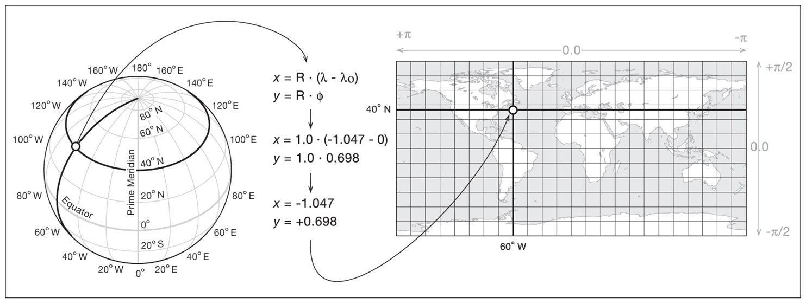
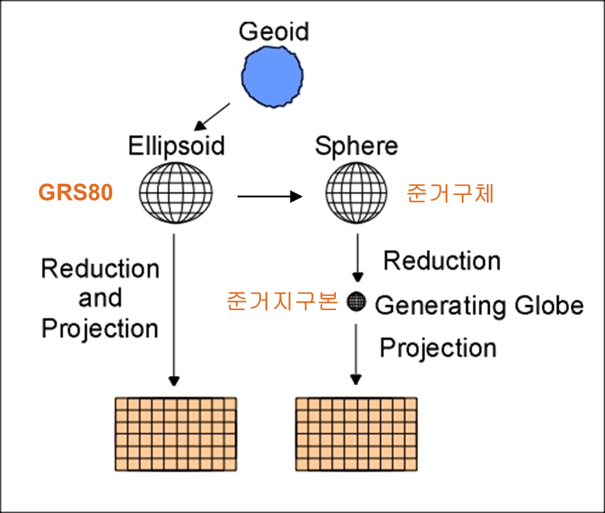
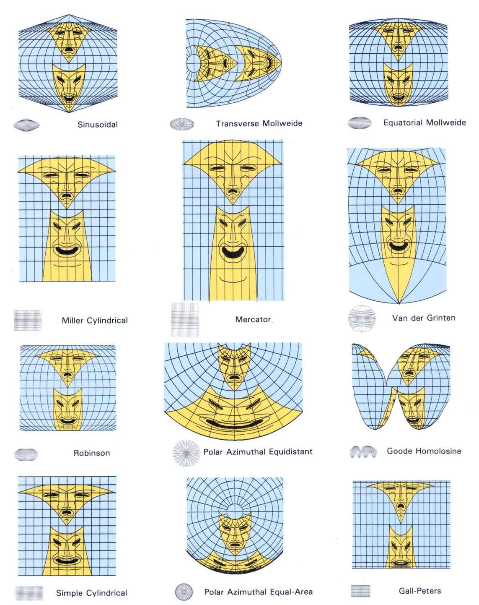
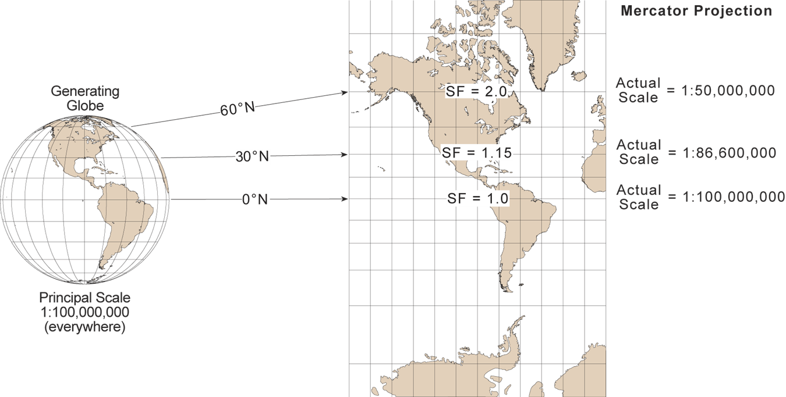
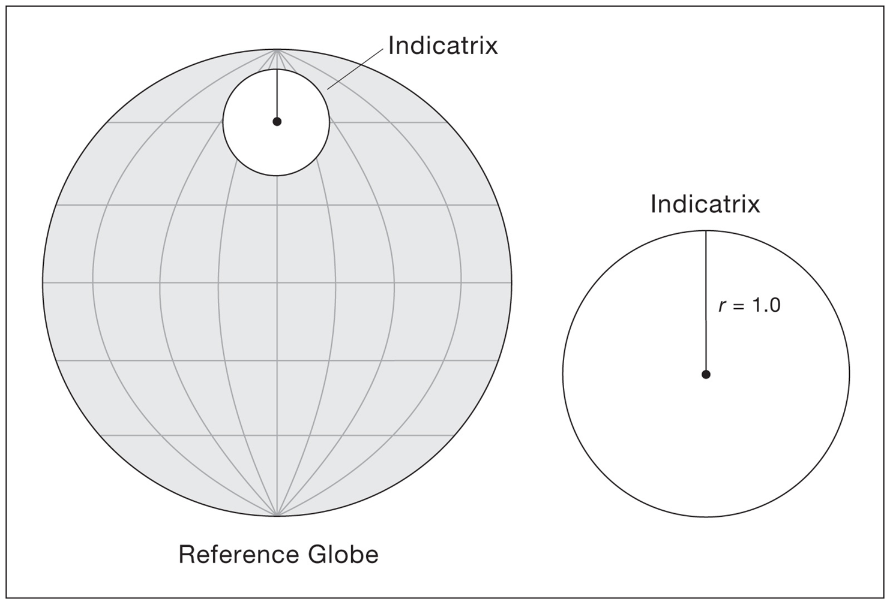
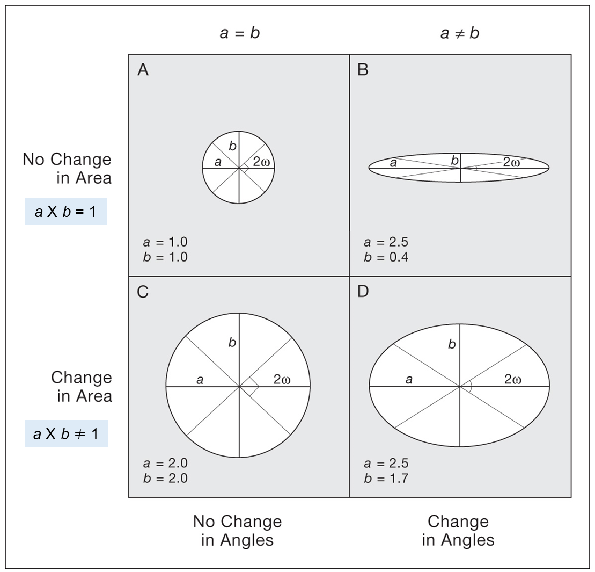

## 지도 투영의 정의와 과정

### 지도 투영의 정의



### 지도 투영의 과정



## 지도 투영의 기본 요소

### 거리

```{r}
library(tidyverse)
library(sf)
library(tmap)
library(tmaptools)
library(spData)
library(geosphere)

world_whole <- world |> st_union()
ortho_crs <- "+proj=ortho +lat_0=30 +lon_0=20 +datum=WGS84 +units=m +no_defs"

pts <- tibble(
  name = c("A (45°N, 0°E)", "B (60°N, 60°E)", "North Pole"),
  lon  = c(0, 60, 0),
  lat  = c(45, 60, 90)
) |> 
  st_as_sf(coords = c("lon", "lat"), crs = 4326)

A <- c(0, 45) 
B <- c(60, 60)
NP <- c(0, 90)

# 대권
make_gc <- function(p1, p2, n = 200) {
  xy <- geosphere::gcIntermediate(
    p1, p2,
    n = n,
    addStartEnd = TRUE,
    breakAtDateLine = FALSE
  )
  st_sfc(
    st_linestring(xy),
    crs = 4326
  ) |>
    st_sf()
}

gc_AB_short <- make_gc(A, B, n = 100)

gc_NP_A <- make_gc(NP, A, n = 100)
gc_NP_B <- make_gc(NP, B, n = 100)

gc_AB_full <- greatCircle(A, B, n = 360) |> 
  st_linestring() |> 
  st_sfc(crs = 4326) |> 
  st_sf() |> 
  st_wrap_dateline(options = c("WRAPDATELINE=YES", "DATELINEOFFSET=180"))

# 구면삼각형
tri_coords <- rbind(
  st_coordinates(gc_NP_A)[, 1:2],
  st_coordinates(gc_AB_short)[, 1:2],
  st_coordinates(gc_NP_B)[nrow(st_coordinates(gc_NP_B)):1, 1:2],
  st_coordinates(gc_NP_A)[1, 1:2]
)

spherical_triangle <- st_sfc(
  st_polygon(list(tri_coords)),
  crs = 4326
) |>
  st_sf()
```

- 지도 제작

```{r}
#| fig-height: 12.914
#| fig-width: 12.94149
#| fig-dpi: 600

my_map <- tm_shape(world_whole) + tm_polygons(fill = "gray90") +
  tm_crs(ortho_crs, bbox = "FULL") +
  tm_graticules(
    x = seq(-180, 180, by = 30),
    y = seq(-90, 90, by = 30),
    labels.show = FALSE, lwd = 2) +
  tm_shape(gc_AB_full) + tm_lines(lwd = 3, lty = 2, col = "gray20") +
  tm_shape(gc_AB_short) + tm_lines(lwd = 4, col = "black") +
  tm_layout(earth_boundary = TRUE, frame = FALSE) +
  tm_credits("SANG-IL LEE, Geography Education at SNU", 
             size = 0.7, position = c(0.80, -0.005))
my_map
```

- 저장

```{r}
#| echo: false
#| eval: false
my.ratio <- get_asp_ratio(my_map)

my.title <- "7-2-1 구면삼각법1"
my.file.name <- paste0("D:/My Cartography/지도제작/", my.title, ".png")
tmap_save(my_map, filename = my.file.name, height = 11.74*1.1, 
          width = my.ratio*11.74*1.1, dpi = 600)
```

- 지도 제작

```{r}
#| fig-height: 12.914
#| fig-width: 12.94149
#| fig-dpi: 600
my_map <- tm_shape(world_whole) + tm_polygons(fill = "gray90") +
  tm_crs(ortho_crs, bbox = "FULL") +
  tm_graticules(
    x = seq(-180, 180, by = 30),
    y = seq(-90, 90, by = 30),
    labels.show = FALSE, lwd = 2) +
  tm_shape(spherical_triangle) + tm_polygons(fill = NULL, lwd = 4, col = "black") +
  tm_shape(gc_AB_full) + tm_lines(lwd = 3, lty = 2, col = "gray20") +
  tm_layout(earth_boundary = TRUE, frame = FALSE) +
  tm_credits("SANG-IL LEE, Geography Education at SNU", 
             size = 0.7, position = c(0.80, -0.005))
my_map
```

- 저장

```{r}
#| echo: false
#| eval: false
my.ratio <- get_asp_ratio(my_map)

my.title <- "7-2-2 구면삼각법2"
my.file.name <- paste0("D:/My Cartography/지도제작/", my.title, ".png")
tmap_save(my_map, filename = my.file.name, height = 11.74*1.1, 
          width = my.ratio*11.74*1.1, dpi = 600)
```

### 방향과 방위

### 형태 혹은 각도

### 면적

## 왜곡의 측정과 시각화



### 축척 계수



### 티소의 인디카트릭스





#### 사례: 메르카토르 도법

- 인디카트릭스 생성

```{r}
library(tidyverse)
library(spData)
library(sf)
library(tmap)
library(tmaptools)
source("https://raw.githubusercontent.com/mgimond/tissot/master/Tissot_functions.r")

proj.merc   <- "+proj=merc +ellps=WGS84"

lat <- seq(-80,80, by=20L)
lon <- seq(-160,160, by=20L)
coord <- as.matrix(expand.grid(lon,lat))

ts.lst <- coord |> as_tibble() |> 
  pmap(\(...) ti(coord = c(...), proj.out = proj.merc))
tsf <- tissot_sf(ts.lst, proj.out = proj.merc)
world_merc <- st_transform(world, proj.merc)
```

- 지도 제작

```{r}
#| fig-height: 12.914
#| fig-width: 12.98416
#| fig-dpi: 600

origin_lines <- st_sfc(
  st_linestring(matrix(c(-180, 0, 180, 0), ncol = 2, byrow = TRUE)), 
  st_linestring(matrix(c(0, -85, 0, 85), ncol = 2, byrow = TRUE)),   
  crs = 4326
)

my_map <- tm_shape(world_merc, bbox = c(-180, -85, 180, 85)) + 
  tm_fill(fill = "#fffff0") +
  tm_graticules(x = seq(-180, 180, 10), 
                y = c(-85, seq(-80, 80, 10), 85), 
                labels.show = FALSE, lwd = 0.1, col = "black") +
  tm_shape(origin_lines) + tm_lines(col = "black", lwd = 1) +
  tm_shape(tsf$ind) + tm_fill(fill = "#e65100", fill_alpha = 0.50) +
  tm_layout(inner.margins = c(0, 0, 0, 0), bg.color = "#d1ecf9") +
  tm_credits("SANG-IL LEE, Geography Education at SNU", 
             size = 0.7, position = c(0.80, -0.005))
my_map  
```

- 저장

```{r}
#| echo: false
#| eval: false
my.ratio <- get_asp_ratio(my_map)

my.title <- "7-3-1 티소 메르카토르"
my.file.name <- paste0("D:/My Cartography/지도제작/", my.title, ".png")
tmap_save(my_map, filename = my.file.name, height = 11.74*1.1, 
          width = my.ratio*11.74*1.1, dpi = 600)
```

#### 사례: 심사 도법

- 정말 어렵다.

#### 사례: 플라트 카레

- 인디카트릭스 생성

```{r}
proj.eqc   <- "+proj=eqc +lat_ts=0 +lat_0=0 +lon_0=0 +x_0=0 +y_0=0 +datum=WGS84 +units=m +no_defs"

lat <- seq(-80,80, by=20L)
lon <- seq(-160,160, by=20L)
coord <- as.matrix(expand.grid(lon,lat))

ts.lst <- coord |> as_tibble() |> 
  pmap(\(...) ti(coord = c(...), proj.out = proj.eqc))
tsf <- tissot_sf(ts.lst, proj.out = proj.eqc)
world_eqc <- st_transform(world, proj.eqc)
```

- 지도 제작

```{r}
#| fig-height: 12.914
#| fig-width: 25.828
#| fig-dpi: 600
my_map <- tm_shape(world_eqc, bbox = c(-180, -90, 180, 90)) + 
  tm_fill(fill = "#fffff0") +
  tm_graticules(x = seq(-180, 180, 10), 
                y = seq(-90, 90, 10), 
                labels.show = FALSE, lwd = 0.1, col = "black") +
  tm_shape(origin_lines) + tm_lines(col = "black", lwd = 1) +
  tm_shape(tsf$ind) + tm_fill(fill = "#e65100", fill_alpha = 0.50) +
  tm_layout(inner.margins = c(0, 0, 0, 0), bg.color = "#d1ecf9") +
  tm_credits("SANG-IL LEE, Geography Education at SNU", 
             size = 0.7, position = c(0.80, -0.005))
my_map
```

- 저장

```{r}
#| echo: false
#| eval: false
my.ratio <- get_asp_ratio(my_map)

my.title <- "7-3-2 플라트 카레"
my.file.name <- paste0("D:/My Cartography/지도제작/", my.title, ".png")
tmap_save(my_map, filename = my.file.name, height = 11.74*1.1, 
          width = my.ratio*11.74*1.1, dpi = 600)
```

#### 사례: 람베르트 정적 원통 도법

- 인디카트릭스 생성

```{r}
proj.cea   <- "+proj=cea +lat_ts=0 +lon_0=0 +x_0=0 +y_0=0 +ellps=WGS84 +units=m +no_defs"

lat <- seq(-80,80, by=20L)
lon <- seq(-160,160, by=20L)
coord <- as.matrix(expand.grid(lon,lat))

ts.lst <- coord |> as_tibble() |> 
  pmap(\(...) ti(coord = c(...), proj.out = proj.cea))
tsf <- tissot_sf(ts.lst, proj.out = proj.cea)
world_cea <- st_transform(world, proj.cea)
```

- 지도 제작

```{r}
#| fig-height: 7.7
#| fig-width: 24.24444
#| fig-dpi: 600
my_map <- tm_shape(world_cea, bbox = c(-180, -90, 180, 90)) + 
  tm_fill(fill = "#fffff0") +
  tm_graticules(x = seq(-180, 180, 10), 
                y = seq(-90, 90, 10), 
                labels.show = FALSE, lwd = 0.1, col = "black") +
  tm_shape(origin_lines) + tm_lines(col = "black", lwd = 1) +
  tm_shape(tsf$ind) + tm_fill(fill = "#e65100", fill_alpha = 0.50) +
  tm_layout(inner.margins = c(0, 0, 0, 0), bg.color = "#d1ecf9") +
  tm_credits("SANG-IL LEE, Geography Education at SNU", 
             size = 0.7, position = c(0.80, -0.005))
my_map
```

- 저장

```{r}
#| echo: false
#| eval: false
my.ratio <- get_asp_ratio(my_map)

my.title <- "7-3-3 람베르트 정적 원통 도법"
my.file.name <- paste0("D:/My Cartography/지도제작/", my.title, ".png")
tmap_save(my_map, filename = my.file.name, height = 7*1.1, 
          width = my.ratio*7*1.1, dpi = 600)
```

#### 사례: 골-페터스 도법

- 인디카트릭스 생성

```{r}
proj.peters <- "+proj=cea +lat_ts=45 +lon_0=0 +x_0=0 +y_0=0 +ellps=WGS84 +units=m +no_defs"

lat <- seq(-80,80, by=20L)
lon <- seq(-160,160, by=20L)
coord <- as.matrix(expand.grid(lon,lat))

ts.lst <- coord |> as_tibble() |> 
  pmap(\(...) ti(coord = c(...), proj.out = proj.peters))
tsf <- tissot_sf(ts.lst, proj.out = proj.peters)
world_peters <- st_transform(world, proj.peters)
```

- 지도 제작

```{r}
#| fig-height: 12.914
#| fig-width: 20.39897
#| fig-dpi: 600

standard_parallels <- st_sfc(
  st_linestring(matrix(c(-180, 45, 180, 45), ncol = 2, byrow = TRUE)), 
  st_linestring(matrix(c(-180, -45, 180, -45), ncol = 2, byrow = TRUE)), 
  crs = 4326
)

my_map <- tm_shape(world_peters, bbox = c(-180, -90, 180, 90)) + 
  tm_fill(fill = "#fffff0") +
  tm_graticules(x = seq(-180, 180, 10), 
                y = seq(-90, 90, 10), 
                labels.show = FALSE, lwd = 0.1, col = "black") +
  tm_shape(origin_lines) + tm_lines(col = "black", lwd = 1) +
  tm_shape(standard_parallels) + tm_lines(col = "#e41a1c", lwd = 1.5) +
  tm_shape(tsf$ind) + tm_fill(fill = "#e65100", fill_alpha = 0.50) +
  tm_layout(inner.margins = c(0, 0, 0, 0), bg.color = "#d1ecf9") +
  tm_credits("SANG-IL LEE, Geography Education at SNU", 
             size = 0.7, position = c(0.80, -0.005))
my_map
```

- 저장

```{r}
#| echo: false
#| eval: false
my.ratio <- get_asp_ratio(my_map)

my.title <- "7-3-4 골-페터스 도법"
my.file.name <- paste0("D:/My Cartography/지도제작/", my.title, ".png")
tmap_save(my_map, filename = my.file.name, height = 11.74*1.1, 
          width = my.ratio*11.74*1.1, dpi = 600)
```

#### 사례: 호보-다이어 도법

- 인디카트릭스 생성

```{r}
proj.hobo <- "+proj=cea +lat_ts=37.5 +lon_0=0 +x_0=0 +y_0=0 +ellps=WGS84 +units=m +no_defs"

lat <- seq(-80,80, by=20L)
lon <- seq(-160,160, by=20L)
coord <- as.matrix(expand.grid(lon,lat))

ts.lst <- coord |> as_tibble() |> 
  pmap(\(...) ti(coord = c(...), proj.out = proj.hobo))
tsf <- tissot_sf(ts.lst, proj.out = proj.hobo)
world_hobo <- st_transform(world, proj.hobo)
```

- 지도 제작

```{r}
#| fig-height: 12.914
#| fig-width: 25.65631
#| fig-dpi: 600

standard_parallels <- st_sfc(
  st_linestring(matrix(c(-180, 37.5, 180, 37.5), ncol = 2, byrow = TRUE)), 
  st_linestring(matrix(c(-180, -37.5, 180, -37.5), ncol = 2, byrow = TRUE)), 
  crs = 4326
)

my_map <- tm_shape(world_hobo, bbox = c(-180, -90, 180, 90)) + 
  tm_fill(fill = "#fffff0") +
  tm_graticules(x = seq(-180, 180, 10), 
                y = seq(-90, 90, 10), 
                labels.show = FALSE, lwd = 0.1, col = "black") +
  tm_shape(origin_lines) + tm_lines(col = "black", lwd = 1) +
  tm_shape(standard_parallels) + tm_lines(col = "#e41a1c", lwd = 1.5) +
  tm_shape(tsf$ind) + tm_fill(fill = "#e65100", fill_alpha = 0.50) +
  tm_layout(inner.margins = c(0, 0, 0, 0), bg.color = "#d1ecf9") +
  tm_credits("SANG-IL LEE, Geography Education at SNU", 
             size = 0.7, position = c(0.80, -0.005))
my_map
```

- 저장

```{r}
#| echo: false
#| eval: false
my.ratio <- get_asp_ratio(my_map)

my.title <- "7-3-5 호보-다이어 도법"
my.file.name <- paste0("D:/My Cartography/지도제작/", my.title, ".png")
tmap_save(my_map, filename = my.file.name, height = 11.74*1.1, 
          width = my.ratio*11.74*1.1, dpi = 600)
```

#### 사례: 밀러 도법

- 인디카트릭스 생성

```{r}
proj.mill <- "+proj=mill +lat_0=0 +lon_0=0 +x_0=0 +y_0=0 +R=6371000 +units=m +no_defs"

lat <- seq(-80,80, by=20L)
lon <- seq(-160,160, by=20L)
coord <- as.matrix(expand.grid(lon,lat))

ts.lst <- coord |> as_tibble() |> 
  pmap(\(...) ti(coord = c(...), proj.out = proj.mill))
tsf <- tissot_sf(ts.lst, proj.out = proj.mill)
world_mill <- st_transform(world, proj.mill)
```

- 지도 제작

```{r}
#| fig-height: 12.914
#| fig-width: 19.81541
#| fig-dpi: 600
my_map <- tm_shape(world_mill, bbox = c(-180, -85, 180, 85)) + 
  tm_fill(fill = "#fffff0") +
  tm_graticules(x = seq(-180, 180, 10), 
                y = seq(-90, 90, 10), 
                labels.show = FALSE, lwd = 0.1, col = "black") +
  tm_shape(origin_lines) + tm_lines(col = "black", lwd = 1) +
  tm_shape(tsf$ind) + tm_fill(fill = "#e65100", fill_alpha = 0.50) +
  tm_layout(inner.margins = c(0, 0, 0, 0), bg.color = "#d1ecf9") +
  tm_credits("SANG-IL LEE, Geography Education at SNU", 
             size = 0.7, position = c(0.80, -0.005))
my_map
```

- 저장

```{r}
#| echo: false
#| eval: false
my.ratio <- get_asp_ratio(my_map)

my.title <- "7-3-6 밀러 도법"
my.file.name <- paste0("D:/My Cartography/지도제작/", my.title, ".png")
tmap_save(my_map, filename = my.file.name, height = 11.74*1.1, 
          width = my.ratio*11.74*1.1, dpi = 600)
```

#### 사례: 정거 원추 도법: 어렵다!!!!

- 인디카트릭스 생성

```{r}
#| eval: false
proj.eqdc <- "+proj=eqdc +lat_1=33 +lat_2=45 +lat_0=0 +lon_0=0 +x_0=0 +y_0=0 +datum=WGS84 +units=m +no_defs"

lat <- seq(-60,80, by=20L)
lon <- seq(-160,160, by=20L)
coord <- as.matrix(expand.grid(lon,lat))

ts.lst <- coord |> as_tibble() |> 
  pmap(\(...) ti(coord = c(...), proj.out = proj.eqdc))
tsf <- tissot_sf(ts.lst, proj.out = proj.eqdc)
world_eqdc <- st_transform(world, proj.eqdc)
```

- 지도 제작

```{r}
#| eval: false
#| fig-height: 12.914
#| fig-width: 19.81541
#| fig-dpi: 600
my_map <- tm_shape(world_eqdc, bbox = c(-180, -90, 180, 90)) + 
  tm_fill(fill = "#fffff0") +
  tm_graticules(x = seq(-180, 180, 10), 
                y = seq(-90, 90, 10), 
                labels.show = FALSE, lwd = 0.1, col = "black") +
  tm_shape(origin_lines) + tm_lines(col = "black", lwd = 1) +
  tm_shape(tsf$ind) + tm_fill(fill = "#e65100", fill_alpha = 0.50) +
  tm_layout(inner.margins = c(0, 0, 0, 0), bg.color = "#d1ecf9") +
  tm_credits("SANG-IL LEE, Geography Education at SNU", 
             size = 0.7, position = c(0.80, -0.005))
my_map
```
